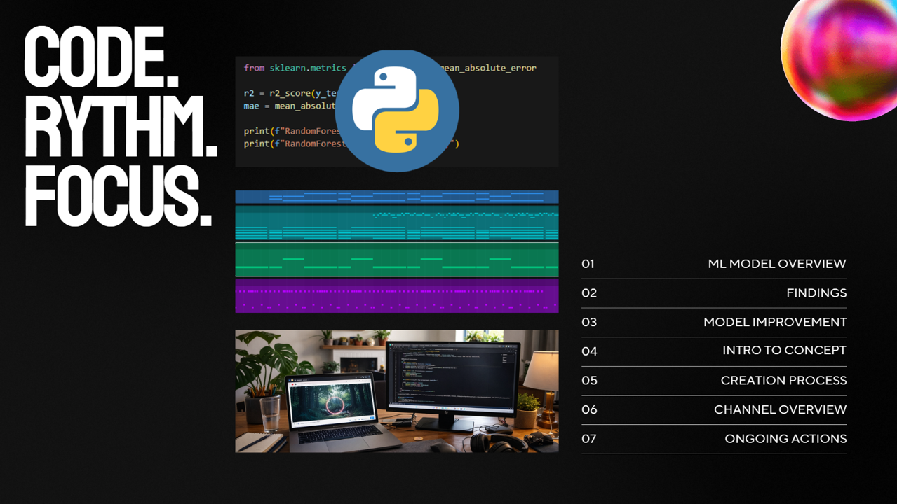

# 🎵 NeuroBeats by TheBeat

### YouTube Niche Analytics & Engagement Prediction

### `Python` · `Machine Learning` · `XGBoost` · `Random Forest` · `SHAP` · `YouTube Data API v3` · `Data Analytics`

> **End-to-end machine learning and analytics project** combining YouTube API data, audience behavior analysis, predictive modeling, explainable AI, and experimental audio generation to understand engagement dynamics within focus-oriented music communities.

🎵 **[View the project presentation on Canva → NeuroBeats by TheBeat](https://canva.link/c789uul6xotkwh0)**

[](https://canva.link/c789uul6xotkwh0)

---

## 👤 About This Project

**David Hernandez | Data Analyst**
📍 Lisbon, Portugal · 2025–2026

NeuroBeats is an end-to-end applied Machine Learning project focused on modeling engagement dynamics within highly specific YouTube niches:

* 🎧 Lofi
* 🌙 Chillhop
* 📚 Study-oriented content
* 🧠 Binaural beats for concentration

Using YouTube Data API data, feature engineering, predictive modeling, and explainable AI techniques, the project investigates the factors that influence audience engagement and content performance.

Beyond analytics, NeuroBeats explores the intersection of listener behavior, focus-oriented audio, and binaural beat frequencies — transforming data-driven insights into experimental audio products designed around concentration, relaxation, and productivity.

The result is a hybrid project combining analytics, machine learning, audience research, and experimental audio development into a single end-to-end workflow.

---

## 🎯 Business Problem

The lofi and study music ecosystem has grown into one of YouTube's most competitive content categories, attracting millions of listeners seeking focus, relaxation, and productivity support.

Yet creators often rely on intuition when deciding:

* Which content formats to publish
* How audience behavior changes over time
* Which channels consistently outperform expectations
* What factors drive engagement within highly specialized music communities

This project explores a central question:

> **Can audience engagement in focus-oriented music niches be modeled, explained, and leveraged to create better content experiences?**

The objective was not only to predict performance, but to understand the underlying signals driving audience behavior.

---

## 🛠️ Tech Stack

| Tool                    | Usage                                     |
| ----------------------- | ----------------------------------------- |
| **Python 3**            | Core analysis and modeling                |
| **Pandas**              | Data cleaning and feature engineering     |
| **YouTube Data API v3** | Data acquisition                          |
| **Scikit-learn**        | Validation and modeling workflows         |
| **Random Forest**       | Baseline predictive modeling              |
| **XGBoost**             | Advanced predictive modeling              |
| **SHAP**                | Explainable AI and feature interpretation |
| **Matplotlib**          | Exploratory analysis and visualization    |
| **Tableau**             | Interactive dashboards and reporting      |

---

## 📊 Dataset

The dataset was constructed through direct integration with the YouTube Data API and enriched through custom feature engineering.

**Final dataset: 925 videos · 28 features · 2019–2026**, sampled across lofi, chillhop, and study-oriented keywords.

Collected information included:

* Channel-level performance metrics
* Subscriber counts
* View counts
* Video engagement indicators
* Upload frequency patterns
* Channel authority metrics
* Audience behavior signals

Additional derived variables were engineered to improve predictive performance and uncover hidden relationships within the niche:

* **log_engagement** — log-stabilized target variable (likes + comments)
* **is_pomodoro / is_live** — niche-specific title triggers
* **has_visuals** — high-quality/4K aesthetic markers
* **is_long_form** — strategic duration flag (> 20 min)
* **log_subscribers** — channel authority signal

---

## 🔍 What Was Built

### Section 1 — Data Collection & Feature Engineering

* Extracted channel and video-level information through the YouTube Data API
* Cleaned and standardized engagement metrics
* Engineered authority and performance indicators
* Created modeling-ready datasets
* Built reusable data pipelines for future experimentation

### Section 2 — Exploratory Data Analysis

Investigated relationships between:

* Subscriber counts and engagement
* Channel size and performance
* Upload behavior and growth
* Audience interaction patterns
* Niche-level performance trends

The analysis revealed several cases where smaller channels consistently outperformed larger competitors on engagement efficiency — the **"Underdog" effect**.

### Section 3 — Machine Learning Pipeline

Multiple predictive models were developed and evaluated:

* Random Forest V1
* Random Forest V2
* Random Forest V2.1
* Stacking & MLP ensemble experiments
* XGBoost (winning model)

Validation techniques included:

* GroupShuffleSplit by channel
* GroupKFold by keyword
* Leakage detection and mitigation
* Residual analysis

A major focus of the project was identifying and eliminating sources of data leakage that initially produced overly optimistic results:

| Stage | Validation | Mean R² |
| --- | --- | --- |
| Initial random split | Train/test split | 0.49 *(inflated by leakage)* |
| Leakage control | GroupShuffleSplit by channel | 0.17 *(realistic baseline)* |
| Final model | XGBoost + channel authority + GroupKFold | **0.37** *(honest and generalizable)* |

The final models prioritized realistic performance and generalization over inflated metrics.

### Section 4 — Explainable AI

SHAP analysis was implemented to:

* Interpret model decisions
* Identify the strongest engagement drivers
* Validate model behavior
* Generate actionable insights for creators

This stage transformed the project from a predictive exercise into a decision-support framework.

### Section 5 — Neuro Audio Experiments

Insights from the analytics workflow were extended into a practical experimentation phase focused on binaural beat generation.

Custom audio tracks were developed using combinations of carrier frequencies and target brainwave ranges commonly associated with:

* 🧠 Beta (focus and concentration)
* 🌊 Alpha (relaxation and calmness)
* 🌌 Theta (deep relaxation and creativity)

While the project does not attempt to validate neurological effects, it explores how audience preferences and listening behavior can inform the design of focus-oriented audio experiences.

This phase transformed NeuroBeats from a predictive analytics project into an experimental data-driven product concept.

---

## 💡 Key Findings

* Audience engagement is driven by a combination of content, authority, and behavioral signals rather than a single dominant metric.
* **Channel authority sets the floor, not the ceiling:** subscriber count is the strongest predictor of baseline engagement, but it does not guarantee a hit.
* **Niche specialization beats general content:** "Pomodoro" and "Live" title triggers significantly lift engagement — even for smaller channels.
* Larger channels do not automatically achieve higher engagement rates.
* Proper validation cut the initial R² from an inflated 0.49 to a realistic baseline, highlighting the importance of leakage detection — before climbing back to an honest 0.37 with better features.
* Explainability analysis revealed that only a subset of features consistently influenced model predictions.
* Several smaller channels demonstrated engagement efficiency far beyond what their size would suggest.
* The *Study With Me* niche shows strong recency bias — newer videos (2023+) outperform legacy content in active interaction.

---

## 📁 Repository Structure

```text
├── NeuroBeats_by_TheBeat.ipynb          # Main analysis notebook
├── data/                                # Raw and processed datasets
├── models/                              # Trained machine learning models
├── visualizations/                      # Charts and figures
├── audio_experiments/                   # Binaural beat prototypes
└── README.md                            # Project documentation
```

---

## 📈 Project Deliverables

| Deliverable                 | Description                               |
| --------------------------- | ----------------------------------------- |
| **Jupyter Notebook**        | Complete end-to-end analysis workflow     |
| **Machine Learning Models** | `ultimate_xgb_model.pkl` and `best_rf_model.pkl` |
| **Final Dataset**           | `youtube_niche_data_final.csv` — Tableau-ready, with predictions and residuals |
| **SHAP Analysis**           | Explainable AI outputs                    |
| **Visualizations**          | Exploratory and presentation-ready charts |
| **Audio Experiments**       | Data-informed binaural beat prototypes    |
| **Dashboard Assets**        | Reporting and storytelling layer          |

---

## 🚀 Project Highlights

* Built a custom analytical dataset through API integration
* Applied advanced validation techniques to eliminate model leakage
* Implemented explainable AI using SHAP
* Combined analytics, machine learning, audience behavior research, and audio experimentation
* Extended analytical findings into a practical product development concept

---

## About Me

Data Analyst transitioning from 10+ years in IT management and operations, bringing a strong foundation in systems thinking, stakeholder communication, and problem-solving.

I build end-to-end analytical solutions — from data collection and feature engineering to machine learning models, dashboards, and data storytelling — with a focus on transforming data into actionable insights and business value.

📬 [LinkedIn](https://www.linkedin.com/in/david-hernandez-cr-pt/) · [GitHub](https://github.com/davherdel) · [Tableau Public](https://public.tableau.com/app/profile/david.hernandez6239) · [NeuroBeats by TheBeat - Canva](https://canva.link/c789uul6xotkwh0)